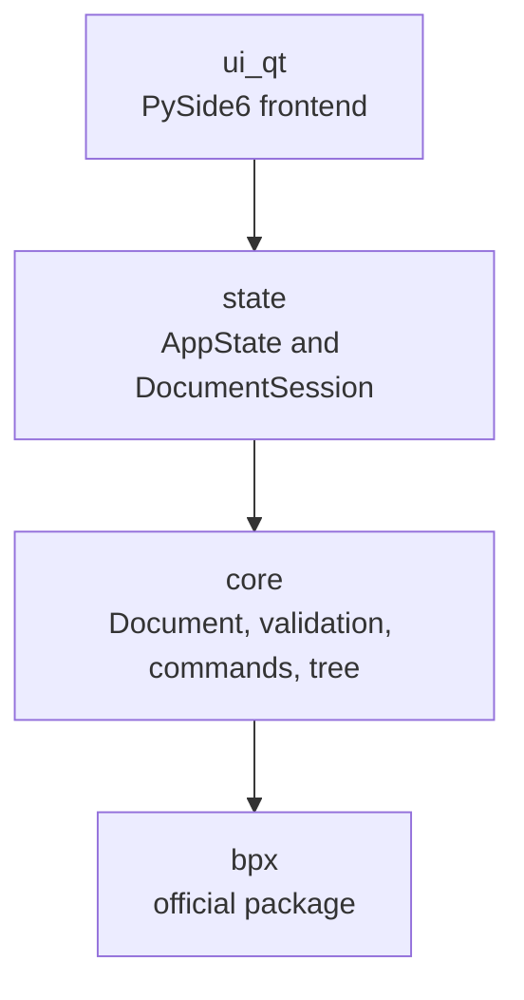
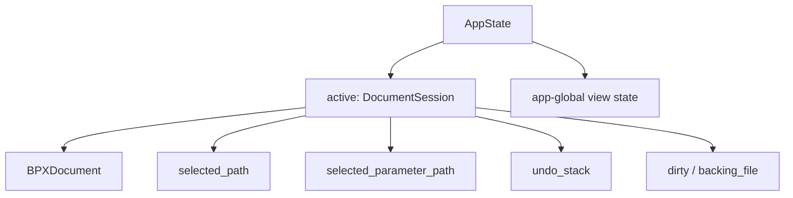
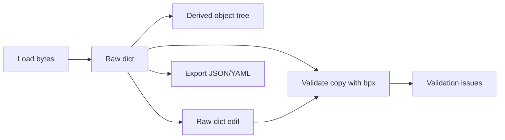

# Explore_BPX — Architecture

This document is the authoritative home for how Explore_BPX is built: its
architectural principles, layered structure, domain model, state model, module
responsibilities, extension seams and constraints. Product vision and principles
live in [00-project.md](00-project.md); application-wide UI structure lives in
[02-ui.md](02-ui.md); feature behaviour lives in [03-features.md](03-features.md).

Design rationale is embedded inline with the decision it explains, rather than
kept as a separate register.

## Architectural Principles

Dependencies flow one way, and BPX semantics stay delegated. Concretely:

- **Delegate BPX semantics.** Schema parsing and validation use the official
  `bpx` package. Explore_BPX does not reimplement or vendor BPX rules.
- **Keep business logic frontend-agnostic.** `core/` and `state/` must not import
  Qt or any UI framework. `tests/test_boundaries.py` enforces this.
- **Use the raw document as editable state.** Invalid and partially edited BPX
  files must remain fully representable.
- **Derive views and validation from state.** Tree nodes, parameter items and
  validation issues are all derived from the raw working document.
- **Separate intent, mutation and orchestration.** Command intent, raw-dict edits
  and command execution are distinct layers.
- **Prefer extension seams over speculative features.** The architecture defines
  stable places for future capabilities without building unused abstractions.

These principles are also hard constraints; they are restated as enforceable
rules in [Architectural Constraints](#architectural-constraints).

## Layered Architecture

Dependencies flow in one direction only:



| Layer | Responsibility |
|---|---|
| `ui_qt/` | PySide6 frontend. Renders state, collects input and coordinates UI navigation. |
| `state/` | Frontend-agnostic application/session state: active document session, selection, undo, dirty/backing-file state and app-level view state. |
| `core/` | BPX integration, validation, document model, tree generation, editing primitives, commands and structural capability queries. |
| `bpx` | Official BPX package, pinned as a dependency. |

## State Model

State is split by ownership so that per-document concerns and app-global concerns
are cleanly separated.



`DocumentSession` owns per-document state: the current `BPXDocument`, the selected
object path, the selected parameter path, undo history, and dirty state with its
backing-file path.

`AppState` owns app-global state and exposes a single active `DocumentSession`
via `state.active`.

**Rationale.** Undo, selection and dirty state are inherently per-document, so
they belong to a session rather than to the application. Conceptually the
application edits a **Workspace** — one Primary document and optionally one
Reference document (see [00-project.md](00-project.md)); today's single active
`DocumentSession` is the degenerate one-document Workspace. Exposing exactly one
`active` session keeps the current single-document application simple while making
multi-document support purely additive: a future `Workspace` can hold a Primary
and an optional Reference session while UI code continues to interact with
`state.active.*` (the Primary) unchanged. The alternatives — keeping a single flat
`AppState`, or introducing a `Workspace`/session collection immediately — either
misplace ownership or add a container before any consumer needs it; introducing
the `Workspace` object before multi-document work begins would be exactly the
speculative abstraction this architecture rejects. The cost is that call sites
address state through `active`.

## Domain Model

### Raw dict as source of truth

A parsed Pydantic `BPX` object cannot represent invalid or partially edited data.
Explore_BPX therefore stores the **raw dictionary** as the editable source of
truth. The parsed BPX model and validation issues are derived by calling
`bpx.parse_bpx_obj` on a deep copy.

This separation is not incidental: `parse_bpx_obj` mutates the object it
receives, so validation must run against a copy and must never mutate the raw
working document.

### Completion and authoring model

Completion is derived separately from BPX validation, in line with the accepted
product principle that the two are distinct (see
[00-project.md](00-project.md)). Validation, delegated to `bpx`, answers whether
the current data satisfies BPX/schema rules. Completion answers whether the
document is finished for an authoring workflow.

The raw BPX dictionary remains the simulator-facing data source. Missing
scientific values must never be represented by fake BPX values solely to satisfy
the editor. If Explore_BPX needs richer states — draft values, template
inheritance, review status, provenance or confidence — those belong in an
authoring/completion layer, never conflated with exported BPX data.

Tree generation, completion views and editing surfaces may therefore expose
expected or unfinished parameters that are not yet present in the raw BPX.
Committing a real value writes BPX data; tracking authoring intent does not.

**This is a foundational architectural commitment, not a future feature.** The
authoring/completion layer is co-equal with editing in the domain model. Its
feature-level behaviour is specified in the Authoring section of
[03-features.md](03-features.md).

### Document, TreeNode and ParameterItem

`BPXDocument` contains the raw working dictionary, the derived validation issues,
and the derived object tree. The derived tree separates navigable BPX objects
from editable values:

```text
TreeNode      = navigable BPX object
ParameterItem = direct parameter owned by a TreeNode
```

Tree nodes are produced by walking the actual raw data rather than only the
schema. This handles BPX polymorphism naturally: SPM/SPMe/DFN/Partial and
single/blended electrode structures are already expressed in the data shape.

Parameters are classified into `ParameterKind` values (scalar, integer, enum,
function, table, unknown). Classification is **declared-type first**: when schema
metadata is available the declared field type is authoritative, and the current
stored value's runtime type does not affect which editor opens. This ensures an
invalid stored value — for example a string committed to a float field — never
causes the editor to switch kind or become read-only. Value shape is used only
for structural kinds (dict/list, which define document topology) and for
`allows_function` fields, where a constant number and a function-expression
string are both valid stored types. Parameters with no schema metadata fall back
to value-shape classification.

### User-defined parameter metadata — accepted decision

A user-authored custom parameter is an ordinary raw-dict entry
(`section[alias] = value`) whose BPX metadata is simply **absent**
(`FieldMeta` is `None`). Nothing is synthesised and nothing is persisted for
it. The current `metadata_index()` covers BPX schema aliases only, and that
remains correct: when metadata exists it dominates classification; when
metadata is genuinely absent, value shape is the honest classifier, and
absence is a valid first-class state, not a gap to be closed.

`classify` already implements this: it is metadata-authoritative when `meta`
is known, and falls back to value-shape classification (numeric → scalar,
string → function, dict/list → structural, otherwise unknown) when `meta` is
`None`. The no-metadata fallback covers two legitimate sources: aliases from
external files that Explore_BPX did not author, and user-authored custom
parameters.

The BPX validator is the source of truth for whether a custom parameter is
legal — the app must not fabricate metadata to make one look schema-known.
There is no mechanism for persisting or looking up metadata for custom
parameters, and none is needed under this model.

## Core Module Responsibilities

| Module | Responsibility |
|---|---|
| `bpx_gateway.py` | The only module that imports `bpx`. Loads JSON/YAML, validates, and builds parameter metadata from the BPX schema. |
| `document.py` | `BPXDocument`: raw dict plus derived tree and validation issues. |
| `editing.py` | Pure raw-dict mutation primitives. |
| `commands.py` | Intent dataclasses and operation result types. |
| `command_service.py` | Preview/execute orchestration over command intent, mutation primitives and structural checks. |
| `structure.py` | Frontend-agnostic structural and capability queries. |
| `document_factory.py` | Incomplete BPX scaffolds without invented scientific values. |
| `tree_model.py` | UI-neutral object tree, parameter rows and validation-path matching helpers. |
| `parameter_types.py` | Value classification and parameter kind metadata. |
| `validation.py` | `ValidationIssue` model and normalisers for Pydantic errors and warnings. |
| `export.py` | Serialises the raw dict to JSON/YAML and can later generalise to target writers. |

## BPX Integration Strategy

Explore_BPX consumes `bpx` as a pinned PyPI dependency (`bpx==1.1.0`). Coupling is
isolated in `core/bpx_gateway.py`, which uses public APIs only: `parse_bpx_obj`,
`BPX`, and `model_json_schema()`.

Alternatives were rejected for the main dependency path:

- a local editable BPX checkout: not reproducible and prone to drift;
- a Git/commit dependency: heavier, and kept only as a fallback for unreleased
  fixes;
- a vendored schema: duplicates the very logic Explore_BPX intentionally
  delegates.

## Document Lifecycle



Loading produces a `BPXDocument` from bytes. Editing produces a new raw dict, then
rebuilds and revalidates the document. Export serialises the raw working document,
which may still contain invalid work-in-progress data.

## Navigation Architecture

Navigation has a single owner in the Qt layer: `NavigationService`. It coordinates
navigation without owning concrete widgets:

1. resolve the target path;
2. update `state.active.selected_path` and `state.active.selected_parameter_path`;
3. emit one notification containing the target identity.

Views subscribe to that notification and reveal their own part of the target — the
tree expands ancestors, the parameter list selects a row, the Inspector loads the
parameter and the context bar updates its location display. The UI-side
subscription and reveal behaviour is specified in [02-ui.md](02-ui.md).

`NavigationService` lives in `ui_qt/` because it is frontend orchestration;
`state/` only stores the selected paths.

**Rationale.** A single owner prevents duplicated, competing navigation logic
while avoiding a service tightly coupled to concrete widgets. The service
coordinates and notifies rather than imperatively driving each widget, so panels
are plug-in subscribers and the frontend boundary stays intact. The alternatives —
each consumer implementing its own navigation, or one service imperatively driving
every widget — either duplicate logic or create brittle coupling. The cost is a
small notification contract. Every current and future consumer (search, validation
review, comparison, Inspector documentation links, Inspector analysis tabs,
database references) navigates through this one service.

## Validation Architecture

Validation runs from the raw working dict via `bpx_gateway.validate`, using a copy
of the raw dict. Errors and warnings are normalised into `ValidationIssue` objects
keyed by alias paths, carrying a path, a message and a severity.

Pydantic locations are not always identical to visible BPX paths: they may be
relative to a section or include union type tags such as `float` or `int`.
`tree_model.py` therefore performs best-effort suffix matching to map validation
issues to the nearest visible `TreeNode` and, where possible, a `ParameterItem`.

A future `IssueKind` classification can describe the remediation implied by an
issue rather than exposing the underlying exception source to the UI. Remediation
logic belongs in pure core functions that take an issue and a raw dict and return
a proposed fixed dict. This is the architectural seam for actionable validation;
its feature behaviour is specified in the Validation section of
[03-features.md](03-features.md).

**Known architectural gap.** Warnings currently lose their field path in some
cases and can land at the document root. Warning-location logic (for example an
`IssueKind.REVIEW_WARNING`) should close that gap when actionable validation is
implemented.

## Editing Architecture

Editing is built around command intent and raw-dict mutation:

- `commands.py` describes operation intent;
- `editing.py` performs pure raw-dict mutations;
- `command_service.py` previews and executes commands with structural guardrails;
- `DocumentSession` records undo history and dirty/backing-file state.

The raw dict remains the editing state. User input can be committed even when
invalid; the derived validated model rejects that state visibly by producing
validation issues. This preserves the ability to open, edit and repair invalid
BPX files.

Per-kind editor widgets are a UI concern, but their architectural contract is
stable: a card edits one `ParameterItem`, emits raw input, and does not decide
whether the value is valid. Validation remains a derived concern. The
user-facing commit model and per-kind card behaviour are specified in the Editing
section of [03-features.md](03-features.md).

The card's editing contract is already independent of document count. A later
self-contained-card refactor — moving the parameter title, validity badge and
summary description into the card so it can host a parameter information popover
(( i )) — changes composition only, not this contract. That refactor is justified
by the parameter information popover ([03-features.md](03-features.md)); future
Workspace portability (rendering two cards side by side) emerges naturally from it
rather than motivating it.

## Command Architecture

Command execution is document-centric. Operation intent is represented as a
command object, previewed or executed by `command_service.py`, and applied via
pure editing primitives. This separation keeps UI interactions, structural rules,
mutation and validation independently testable.

The command layer is the natural home for future operations such as model
switching, section insertion/removal and remediation actions.

## Extension Seams

The architecture defines stable places where planned and future capabilities
attach, without building the capabilities themselves ahead of need.

| Capability | Architectural seam |
|---|---|
| Editing and creation | Command intent, `command_service.py`, `editing.py`, `document_factory.py` and per-document undo in `DocumentSession`. |
| Function/table visualisation | Analysis tab in the Inspector secondary workspace consuming the selected `ParameterItem`; a launcher of `Show` actions that open floating visualisations, with BPX functions exposed through `bpx_gateway.py` / `to_python_function()`. |
| Issue presentation | Qt-owned Issues tab in the Inspector secondary workspace consuming derived `ValidationIssue` state; no core or state dependency on the tab widgets. |
| Authoring, skeletons and templates | `document_factory.py` creates incomplete structures without scientific defaults; completion/template state stays separate from exported BPX data. |
| External database import | A new anti-corruption adapter, mirroring `bpx_gateway.py`, returning raw BPX dicts from third-party sources. |
| Simulator hand-off | `export.py` generalising from serialisation to target-specific writers. |
| Multi-document Workspace and comparison | A `Workspace` holding the Primary and an optional Reference `DocumentSession`; components render the workspace (one or two documents) rather than switching into a compare mode. Shared-tree rendering, ownership indicators and dual inspectors are future design, not built ahead of need. |
| Rich parameter documentation | A parameter-metadata provider layered over `bpx_gateway.py`, combining `FieldMeta` with a separate, versioned educational-metadata dataset (physical meaning, measurement methods, specification links, symbols); sourced and tested independently and never contaminating the BPX gateway, mirroring the plausibility-dataset discipline. |
| Cross-feature navigation | `NavigationService` as the single frontend navigation coordinator. |
| Actionable validation | Future `IssueKind` plus pure remediation functions in `core/`. |
| Plausibility validation | An independent layer (for example `core/sanity.py`) plus a versioned reference dataset, sourced and tested separately from schema validation. |

## Architectural Constraints

These constraints are enforceable and must hold at all times:

- `core/` and `state/` must remain Qt-free (`tests/test_boundaries.py`).
- The raw dict remains the editable source of truth.
- Authoring/completion state must not force placeholders or draft intent into
  exported BPX data.
- BPX schema and validation semantics stay delegated to `bpx`.
- Domain plausibility checks must be separate from schema validation and must
  never be added to `bpx_gateway.py`.
- Future UI features connect through existing state, command and navigation seams
  rather than duplicating traversal or validation logic.
