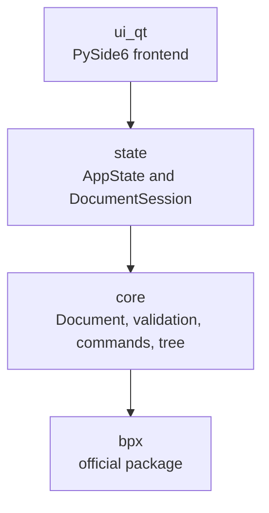
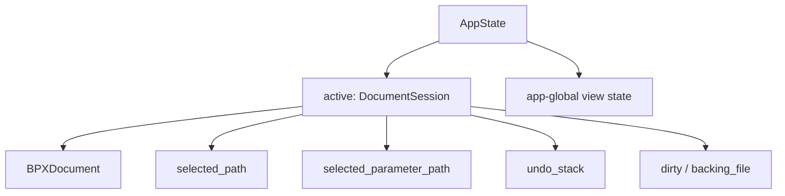
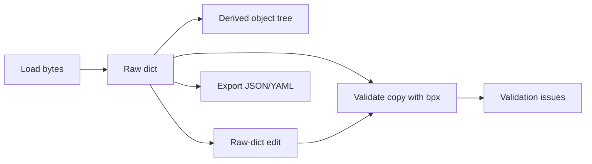

# Explore_BPX Architecture

This document describes how Explore_BPX is built: its architectural principles,
module boundaries, domain model, state model and extension seams. User
interaction decisions live in [ui-design.md](ui-design.md). Capability status and
planned work live in [roadmap.md](roadmap.md).

## Purpose

Explore_BPX is a human interface to the BPX format. It helps users open,
inspect, edit, validate and eventually visualise BPX documents without
reimplementing the BPX standard. Schema parsing and validation remain delegated
to the official `bpx` package.

The product question is: **how do people interact with BPX files?** The
architecture therefore treats validation, navigation and editing as document
workflows layered around BPX data, not as a replacement implementation of BPX.

## Architectural Principles

- **Delegate BPX semantics.** Explore_BPX uses the official `bpx` package for
  schema parsing and validation.
- **Keep business logic frontend-agnostic.** `core/` and `state/` must not import
  Qt or any UI framework.
- **Use the raw document as editable state.** Invalid and partially edited BPX
  files must remain representable.
- **Derive views and validation from state.** Tree nodes, parameter items and
  validation issues are derived from the raw working document.
- **Separate intent, mutation and orchestration.** Command intent, raw-dict edits
  and command execution are distinct layers.
- **Prefer extension seams over speculative features.** The architecture defines
  stable places for future capabilities without building unused abstractions.

## Layered Architecture

Dependencies flow in one direction only:



| Layer | Responsibility |
|---|---|
| `ui_qt/` | PySide6 frontend. Renders state, collects input and coordinates UI navigation. |
| `state/` | Frontend-agnostic application/session state: active document session, selection, undo, dirty/backing-file state and app-level view state. |
| `core/` | BPX integration, validation, document model, tree generation, editing primitives, commands and structural capability queries. |
| `bpx` | Official BPX package, pinned as a dependency. |

`tests/test_boundaries.py` enforces the core boundary: `core/` and `state/` stay
free of UI-framework imports.

## State Model

State is split by ownership:



`DocumentSession` owns per-document state:

- the current `BPXDocument`;
- selected object path;
- selected parameter path;
- undo history;
- dirty state and backing-file path.

`AppState` owns app-global state and exposes a single active `DocumentSession`.
This keeps the current application simple while making future multi-document
support additive: a future `AppState` can hold multiple sessions while UI code
continues to interact with `state.active`.

## Domain Model

### Raw Dict As Source Of Truth

A parsed Pydantic `BPX` object cannot represent invalid or partially edited data.
Explore_BPX therefore stores the **raw dictionary** as the editable source of
truth. The parsed BPX model and validation issues are derived by calling
`bpx.parse_bpx_obj` on a deep copy.

This matters because `parse_bpx_obj` mutates the object it receives. Validation
must never mutate the raw working document.

### Completion And Authoring Model

Completion is derived separately from BPX validation. Validation remains
delegated to the official `bpx` package and answers whether the current BPX data
satisfies BPX/schema rules. Completion answers whether the document is finished
for an authoring workflow.

The raw BPX dictionary remains the simulator-facing data source. Missing
scientific values should not be represented by fake BPX values solely to satisfy
the editor. If Explore_BPX needs richer states such as draft values, template
inheritance, review status, provenance or confidence, those states belong in an
authoring/completion layer rather than being conflated with exported BPX data.

Tree generation, completion views and editing surfaces may expose expected or
unfinished parameters that are not yet present in the raw BPX. Committing a real
value writes BPX data; tracking authoring intent does not.

### Document, TreeNode And ParameterItem

`BPXDocument` contains:

- the raw working dictionary;
- derived validation issues;
- the derived object tree.

The derived tree separates navigable BPX objects from editable values:

```text
TreeNode       = navigable BPX object
ParameterItem = direct parameter owned by a TreeNode
```

Tree nodes are produced by walking the actual raw data rather than only walking
the schema. This handles BPX polymorphism naturally: SPM/SPMe/DFN/Partial and
single/blended electrode structures are already expressed in the data shape.

Parameters are classified into `ParameterKind` values (scalar, integer, enum,
function, table, unknown). Classification is **declared-type first**: when
schema metadata is available the declared field type is authoritative, and the
current stored value's runtime type does not affect which editor opens. This
ensures that an invalid stored value (e.g. a string committed to a float field)
never causes the editor to switch kind or become read-only. Value shape is only
used for structural kinds (dict/list, which define document topology) and for
`allows_function` fields, where a constant number and a function-expression
string are both valid stored types. Parameters with no schema metadata fall back
to value-shape classification.

**Design note for future user-defined parameters.** The declared-type-first
principle requires that user-defined parameters carry explicit type metadata at
creation time. The current `metadata_index()` covers BPX schema aliases only;
parameters authored by Explore_BPX itself (section add/remove, templates) must
synthesise and supply a `FieldMeta` so that `classify` remains metadata-
authoritative for them. The no-metadata fallback is reserved for parameters read
from external files whose aliases do not appear in any known metadata index. The
mechanism for persisting and looking up user-defined parameter metadata is a
design decision for the authoring feature.

## Core Module Responsibilities

| Module | Responsibility |
|---|---|
| `bpx_gateway.py` | The only module that imports `bpx`. Loads JSON/YAML, validates, and builds parameter metadata from the BPX schema. |
| `document.py` | `BPXDocument`: raw dict plus derived tree and validation issues. |
| `editing.py` | Pure raw-dict mutation primitives. |
| `commands.py` | Intent dataclasses and operation result types. |
| `command_service.py` | Preview/execute orchestration over command intent, mutation primitives and structural checks. |
| `structure.py` | Frontend-agnostic structural and capability queries. |
| `document_factory.py` | Incomplete BPX scaffolds without invented scientific values. |
| `tree_model.py` | UI-neutral object tree, parameter rows and validation-path matching helpers. |
| `parameter_types.py` | Value classification and parameter kind metadata. |
| `validation.py` | `ValidationIssue` model and normalisers for Pydantic errors and warnings. |
| `export.py` | Serialises the raw dict to JSON/YAML and can later generalise to target writers. |

## BPX Integration Strategy

Explore_BPX consumes `bpx` as a pinned PyPI dependency (`bpx==1.1.0`). Coupling is
isolated in `core/bpx_gateway.py`, which uses public APIs only:

- `parse_bpx_obj`;
- `BPX`;
- `model_json_schema()`.

Alternatives rejected for the main dependency path:

- local editable BPX checkout: not reproducible and prone to drift;
- Git/commit dependency: heavier and kept only as a fallback for unreleased
  fixes;
- vendored schema: duplicates the logic Explore_BPX intentionally delegates.

## Document Lifecycle

The document lifecycle is:



Loading produces a `BPXDocument` from bytes. Editing produces a new raw dict,
then rebuilds and revalidates the document. Export serialises the raw working
document, which may still contain invalid work-in-progress data.

## Navigation Architecture

Navigation has a single owner in the Qt layer: `NavigationService`.

The service coordinates navigation without owning concrete widgets:

1. resolve the target path;
2. update `state.active.selected_path` and `state.active.selected_parameter_path`;
3. emit one notification containing the target identity.

Views subscribe to that notification and reveal their own part of the target.
For example, the tree expands ancestors, the parameter list selects a row, the
Inspector loads the parameter and the context bar updates its location display.

This keeps navigation consistent for all consumers — search, validation review,
future comparison, Inspector documentation links, Inspector analysis sections and
database references — while preserving the frontend boundary. `NavigationService`
lives in `ui_qt/` because it is part of frontend orchestration; `state/` only
stores the selected paths.

Detailed interaction behaviour for search, highlighting and review is documented
in [ui-design.md](ui-design.md).

## Validation Architecture

Validation runs from the raw working dict via `bpx_gateway.validate`, using a
copy of the raw dict. Errors and warnings are normalised into `ValidationIssue`
objects keyed by alias paths.

Pydantic locations are not always identical to visible BPX paths: they may be
relative to a section or include union type tags such as `float` or `int`.
`tree_model.py` therefore performs best-effort suffix matching to map validation
issues to the nearest visible `TreeNode` and, where possible, a `ParameterItem`.

Current issue data contains:

- path;
- message;
- severity.

A future `IssueKind` classification can describe the remediation implied by an
issue, rather than exposing the underlying exception source to the UI. Proposed
kinds include edit value, move value, choose model, map materials, add section
and review warning. Remediation logic belongs in pure core functions that take
an issue and raw dict and return a proposed fixed dict.

Known architectural gap: warnings currently lose their field path in some cases
and can land at the document root. `IssueKind.REVIEW_WARNING` or equivalent
warning-location logic should close that gap when actionable validation work is
implemented.

## Editing Architecture

Editing is built around command intent and raw-dict mutation:

- `commands.py` describes operation intent;
- `editing.py` performs pure raw-dict mutations;
- `command_service.py` previews and executes commands with structural guardrails;
- `DocumentSession` records undo history and dirty/backing-file state.

The raw dict remains the editing state. User input can be committed to the raw
document even when it is invalid; the derived validated model rejects that state
visibly by producing validation issues. This preserves the ability to open, edit
and repair invalid BPX files.

Per-kind editor widgets are a UI concern, but their architectural contract is
stable: a card edits one `ParameterItem`, emits raw input, and does not decide
whether the value is valid. Validation remains a derived concern.

## Command Architecture

Command execution is document-centric. Operation intent is represented as a
command object, previewed or executed by `command_service.py`, and applied via
pure editing primitives. This separation keeps UI interactions, structural
rules, mutation and validation independently testable.

The command layer is also the natural place for future operations such as model
switching, section insertion/removal and remediation actions.

## Extension Seams

| Capability | Architectural seam |
|---|---|
| Editing and creation | Command intent, `command_service.py`, `editing.py`, `document_factory.py` and per-document undo in `DocumentSession`. |
| Function/table visualisation | Expandable Inspector analysis section consuming the selected `ParameterItem`; BPX functions exposed through `bpx_gateway.py` / `to_python_function()`. |
| Issue presentation | Collapsible Qt-owned Issues drawer consuming derived `ValidationIssue` state; no core or state dependency on drawer widgets. |
| Authoring, skeletons and templates | `document_factory.py` creates incomplete structures without scientific defaults; future completion/template state must remain separate from exported BPX data. |
| External database import | A new anti-corruption adapter, mirroring `bpx_gateway.py`, returns raw BPX dicts from third-party sources. |
| Simulator hand-off | `export.py` can generalise from serialisation to target-specific writers. |
| File comparison | Multiple `DocumentSession` objects plus tree-model diffing and shared navigation. |
| Cross-feature navigation | `NavigationService` is the single frontend navigation coordinator. |
| Actionable validation | Future `IssueKind` plus pure remediation functions in `core/`. |

## Architectural Constraints

- `core/` and `state/` must remain Qt-free.
- The raw dict remains the editable source of truth.
- Authoring/completion state must not force placeholders or draft intent into
  exported BPX data.
- BPX schema and validation semantics stay delegated to `bpx`.
- Domain plausibility checks must be separate from schema validation.
- Future UI features should connect through existing state, command and
  navigation seams rather than duplicating traversal or validation logic.

## Future Architectural Considerations

The schematic's BPX Validator includes plausibility validation: comparison of
values against known or typical cell parameters. That is a distinct concern from
schema validation and requires a reference dataset of domain knowledge.

To preserve the current architecture, plausibility validation should be added as
an independent layer, for example `core/sanity.py` plus a versioned reference
dataset. It should not contaminate `bpx_gateway.py` or duplicate BPX schema
logic. Schema/syntax validation and plausibility validation should remain
independently sourced and independently testable.
