# Explore_BPX · Application Overview

A desktop application for opening, inspecting, validating, comparing and editing BPX battery-parameter files, built on the official BPX validator.

> Python 3.12 · PySide6 (Qt) · Validator: official `bpx` package, v1.1.1 · 1,513 automated tests
> Prepared by Isabella West · August 2026

**Contents**

1. [What the app is](#what-the-app-is)
2. [Workspace: opening and creating files](#1--workspace-opening-and-creating-files)
3. [Editor: inspecting and editing parameters](#2--editor-inspecting-and-editing-parameters)
4. [Validation experiments and plotting](#3--validation-experiments-and-plotting)
5. [Comparing against a reference file](#4--comparing-against-a-reference-file)
6. [Source view: the raw file](#5--source-view-the-raw-file)
7. [Diagnostics: errors, warnings, outstanding](#6--diagnostics-errors-warnings-outstanding)
8. [Design principles and quality assurance](#7--design-principles-and-quality-assurance)
9. [Anticipated questions](#8--anticipated-questions)
10. [Current scope and known limitations](#9--current-scope-and-known-limitations)

---

## What the app is

*One tool for the whole life of a BPX file: open, understand, fix, compare, extend.*

**Background.** BPX (Battery Parameter eXchange) is the Faraday Institution's open JSON standard for describing the physical and electrochemical parameters of a battery cell, so that one parameter set can drive many different simulation tools. The standard is implemented by an official Python package, `bpx`, which defines the schema and validates files against it.

Explore_BPX is a desktop application (Python, Qt via PySide6) that makes BPX files practical to work with. Instead of hand-editing JSON and reading raw validator tracebacks, a user gets a structured editor, live validation on every change, plain-language navigation to each problem, side-by-side comparison against published parameter sets, and chart previews of tabulated data and measured experiment traces.

A deliberate founding decision: **the app does not implement the BPX specification itself**. Every parse, every schema rule and every verdict comes from the official `bpx` package (pinned at version 1.1.1, shown in the status bar). The app's job is to present what the validator says, faithfully and navigably, never to second-guess it. That means a file that validates here validates identically in any other tool built on the same official package.

The app is organised into four pages, reached from the icon rail on the left edge of the window:

| Page | Purpose |
|---|---|
| **Workspace** | Open, create and manage the documents in the session: the editable main document and an optional read-only reference. |
| **Editor** | The main working surface: structure tree, parameter list, and an inspector card for viewing and editing each parameter. |
| **Source** | The raw file, read-only, with folding, and a two-pane aligned comparison when a reference is docked. |
| **Diagnostics** | Every validator finding and every still-missing field, organised by section, with one click navigation to the fix. |

---

## 1 · Workspace: opening and creating files

*The front door: files, new documents, and the reference slot.*

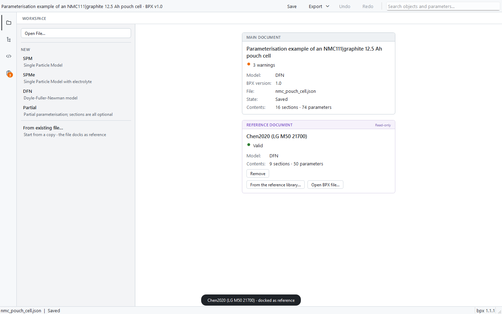

*The Workspace page with a main document open (an About:Energy NMC pouch cell) and the bundled Chen2020 set docked as a read-only reference. The dark pill at the bottom is a transient toast notification confirming the dock.*

- **Open File…** accepts JSON and YAML BPX files; files can also be dragged onto the page. Files that fail validation still open: their problems become navigable diagnostics rather than a refusal.
- **New** scaffolds a fresh document for any model the validator supports: SPM, SPMe, DFN, or Partial (all sections optional). The list is read from the validator, not hardcoded.
- **From existing file…** starts a new document as a copy of a chosen file and automatically docks the original as the reference, so "start from a template and see what I changed" is one action.
- The **Main document** card summarises identity, validity, model, file, saved state and contents. The **Reference document** card (purple accents, marked read-only) manages the docked comparison file.
- Opening a second file while one is open asks whether to replace the main document or add the file as the reference; unsaved changes always prompt before being discarded.

---

## 2 · Editor: inspecting and editing parameters

*Tree of sections · list of parameters · one card per parameter, typed by what the value is.*

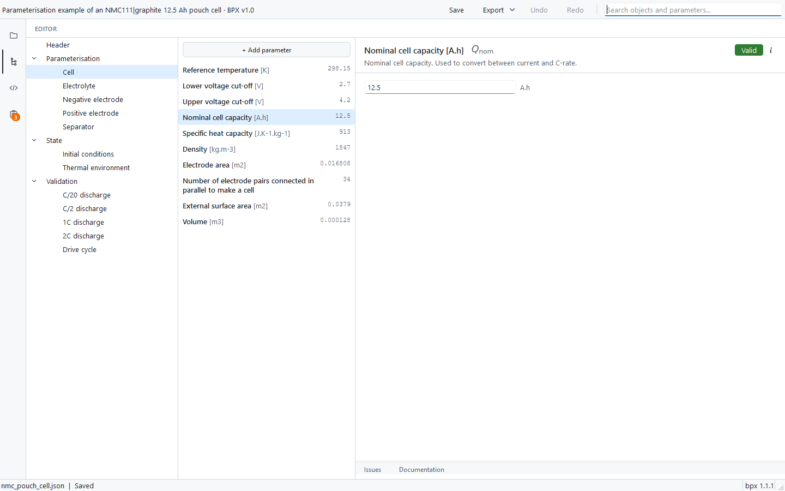

*The three-pane Editor. Left: the document structure. Middle: the selected section's parameters with units and value previews. Right: the inspector card for the selected parameter, with its physical meaning, rendered mathematical symbol, unit, and live validity badge.*

Every parameter opens as a card matched to its kind: scalar, integer, text, boolean, enumeration, function, map, data series or table. Editing follows one consistent contract:

- **Type, see, commit.** Typing validates live (debounced, with the badge updating as you type), **Enter** commits, **Escape** reverts the draft.
- **Invalid values can be committed deliberately.** The app never blocks a commit because the validator dislikes it; the problem is recorded and surfaced as a navigable issue. This matters when transcribing real data: you can save your work mid-fix.
- **Everything is undoable.** Every change, from a single scalar edit to removing a whole section, is exactly one undo step, and undo restores the selection to where the change happened. Undoing back to the last save genuinely reads "Saved" again.

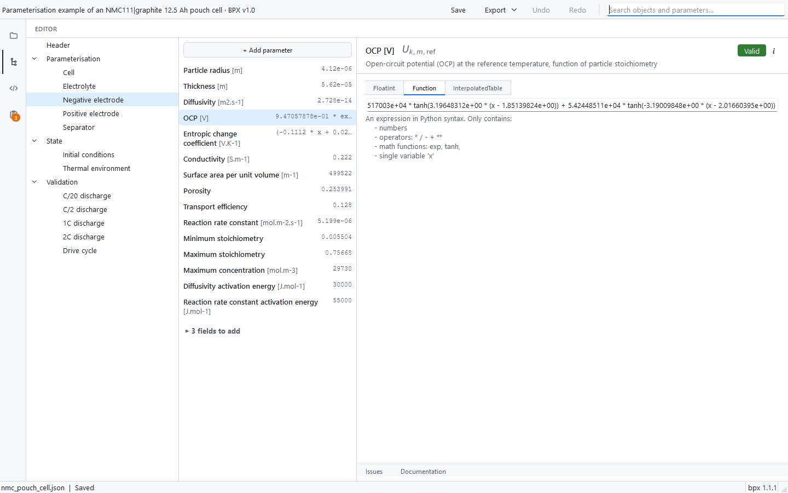

*A function-valued parameter (graphite open-circuit potential). Where the BPX schema allows several representations, the card shows a mode strip in the schema's own vocabulary: here FloatInt, Function, or InterpolatedTable. The editor states exactly what a function expression may contain.*

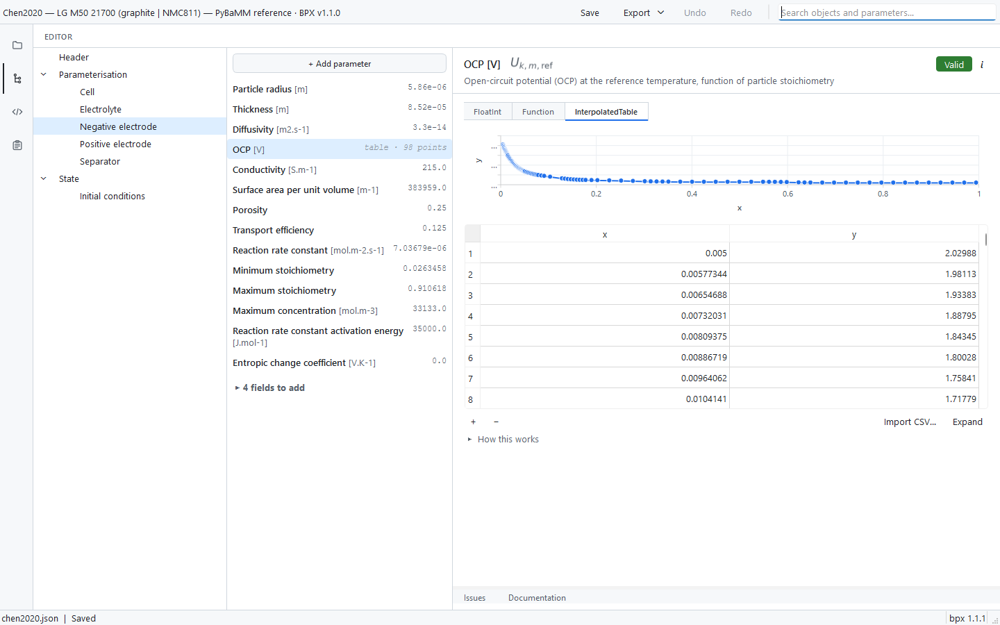

*The same parameter in a different published set, stored as an interpolated table: a live chart preview of the actual value, above a spreadsheet-style grid. Grids support paste from a spreadsheet (with preview), CSV import with column mapping, row add/remove, and an expanded full-pane mode.*

### Adding, renaming and restructuring

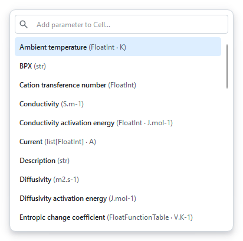

*The add-parameter popup for a section: every parameter the BPX standard allows there, filterable by typing, with schema-expected fields suggested first. A footer action creates a custom (user-defined) parameter with a chosen name, unit and value type.*

- Parameters can be added (standard or custom), renamed where the schema allows it, duplicated, reordered, and removed (with Delete-key support). Sections, electrode materials and experiments are added from the tree's context menu, which only ever offers actions that are legal at that spot.
- A collapsed "**N fields to add**" group at the end of each parameter list offers the schema-expected fields that are still absent, so completing a section never requires memorising the standard.
- Search (`Ctrl+F`) covers every object and parameter in the file and jumps straight to the result. It navigates; it never hides or filters the structure.

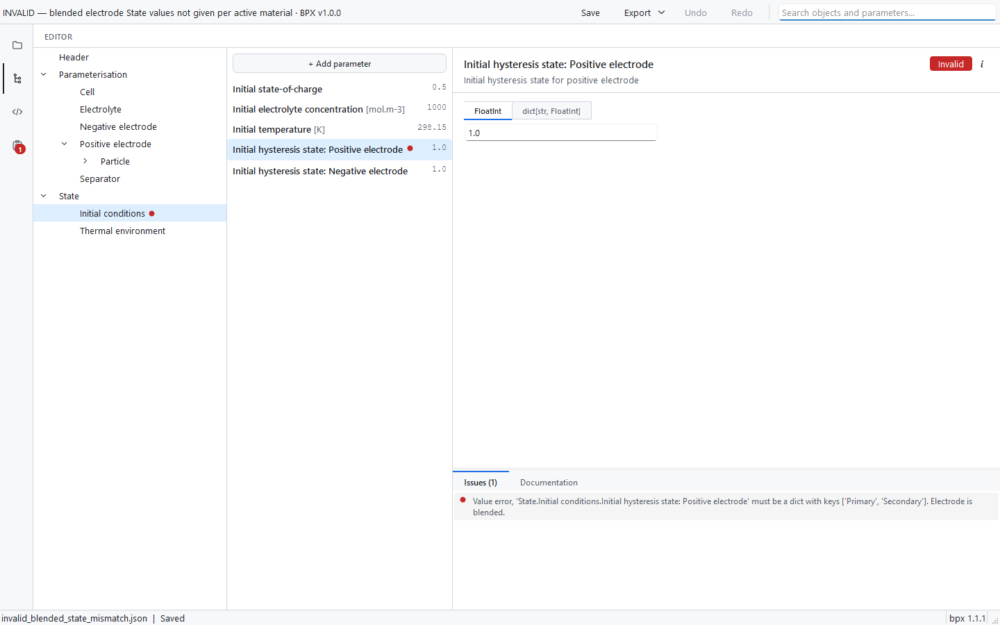

*A file with a real validator error. The failing parameter is marked with a red dot in both the tree and the list; the card badge reads Invalid; and the Issues tab below the card quotes the validator's message verbatim.*

---

## 3 · Validation experiments and plotting

*Measured data lives in the file too, and the app treats it as data, not as JSON.*

BPX files can carry a **Validation** section: measured time, current, voltage and optionally temperature traces used to check the parameter set against reality. Explore_BPX gives each experiment run a dedicated editor.

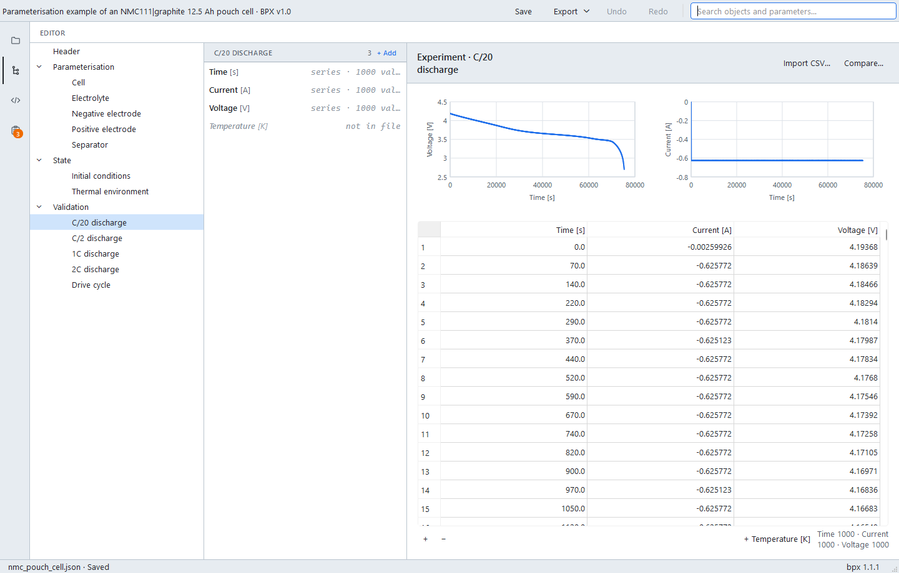

*An experiment run (C/20 discharge, 1,000 samples) edited as one multi-column grid rather than four separate arrays. CSV import, column counts, and a one-click way to add the optional temperature column are built in.*

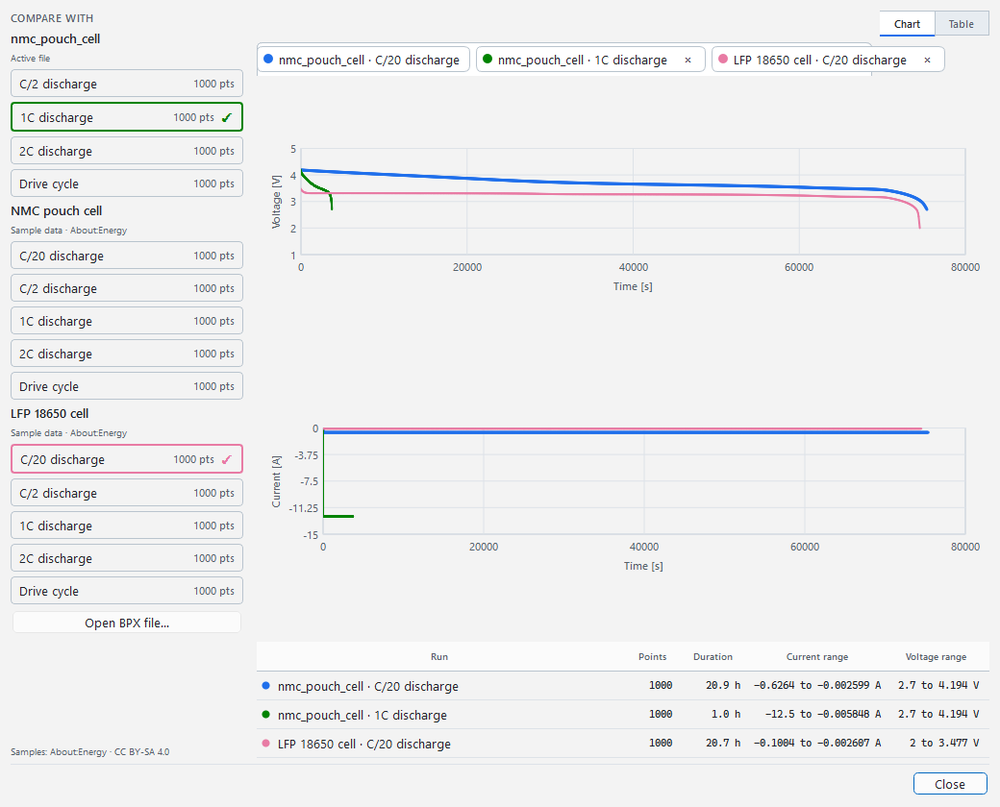

*The Compare dialog for an experiment run: the active file's own trace (blue) overlaid with a bundled reference run (an LFP 18650 cell, green) as small-multiple charts of voltage and current against time, with key numbers tabulated below. Up to four reference runs can be overlaid, from the bundled About:Energy examples or from any BPX file on disk. The view is read-only and never changes the document.*

---

## 4 · Comparing against a reference file

*Purple always means reference. One docked, read-only comparison document, visible from every page.*

Any BPX file, or a bundled published set, can be docked as the **reference**: a read-only snapshot the whole app compares the main document against. This supports the two commonest real questions: "how does my parameterisation differ from the published one?" and "what would a complete file look like here?"

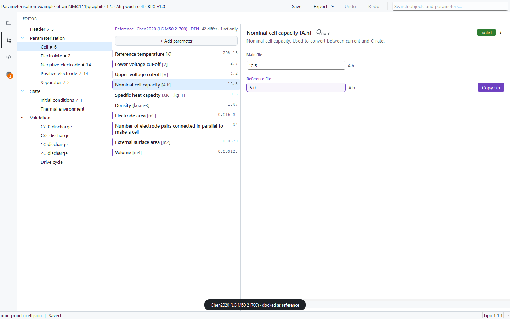

*The Editor with Chen2020 docked as reference. The strip above the list names the reference and counts the differences. Purple bars on the left edge of rows mark values that differ; pale bars mark values that match; the tree carries the same gutter bars, with a quiet right-aligned differ count per section. The card shows the reference value in a purple frame under the editable main value, with a one-click "Copy up".*

- **The reference is never editable and never red.** It is a comparison instrument, not a second document, so comparison marks are deliberately purple, a colour the app reserves for reference material, and never reuse the error/warning colours.
- Parameters that exist only in the reference appear as ghost rows; **Copy up** brings a reference value into the main document as a single undoable step.
- **Make main** swaps the two documents when you decide the reference is the file you actually want to edit.
- Comparison is exact and literal by design: values are compared as written, with no unit conversion, tolerance or fuzzy matching. What you see is exactly what is in the two files.

> **Bundled reference library.** Four published parameter sets ship with the app, converted offline from PyBaMM's parameter library: **Chen2020** (LG M50 21700), **Prada2013** (A123 26650 LFP), **Ai2020** (Enertech pouch) and **Mohtat2020** (NMC532 pouch). The chooser states each set's citation and the BSD 3-Clause origin of the data on screen; the full provenance and conversion caveats are recorded in a NOTICE file alongside the data, and each set's description states how it was derived. The experiment-comparison examples (NMC pouch and LFP 18650 runs) come from About:Energy's published example files, likewise with licence and notice files bundled.

---

## 5 · Source view: the raw file

*For the user who wants to see exactly what is on disk. Read-only, always.*

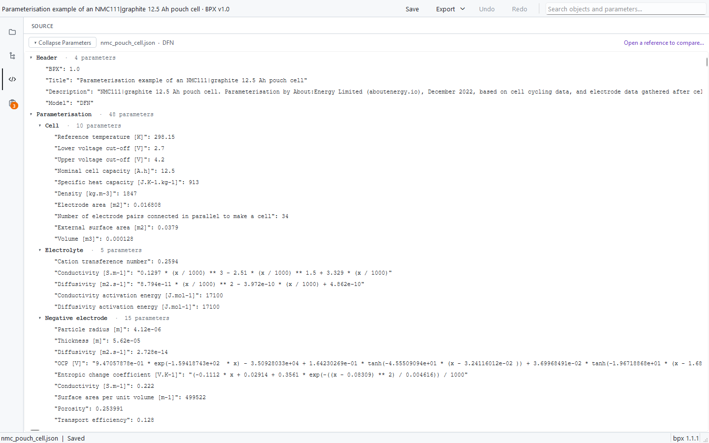

*The Source page: the document as raw JSON with section folding and per-section parameter counts. The page contains no editing controls at all; changing values is the Editor's job.*

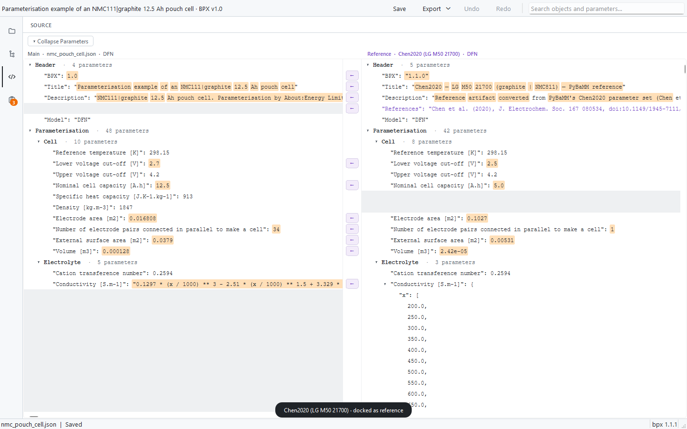

*With a reference docked, Source becomes a two-pane aligned comparison: same key on the same line, differing values highlighted, grey blocks where one side lacks a key, reference-only material in purple. The small ← chips in the centre gutter pull a reference value into the main document as one undo step.*

---

## 6 · Diagnostics: errors, warnings, outstanding

*One page that answers "what is wrong, and what is left to do?"*

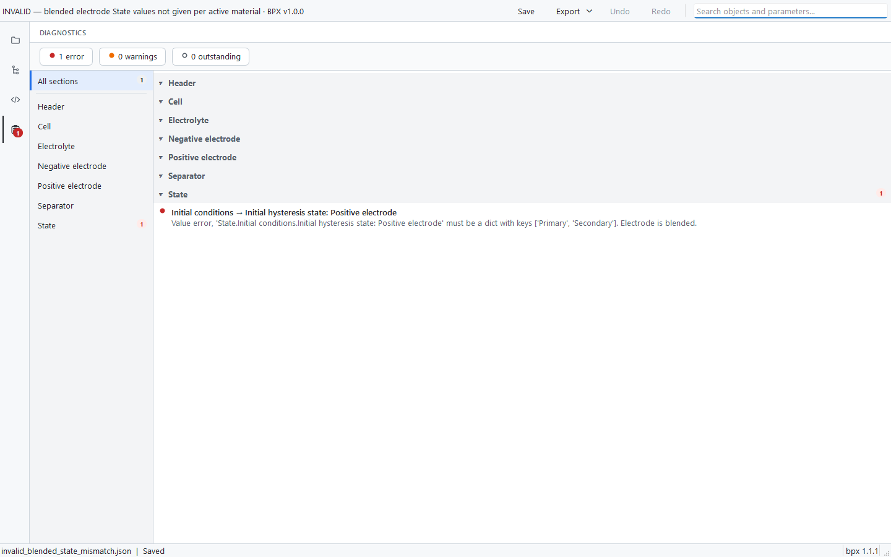

*The Diagnostics page for a deliberately invalid file. The strip counts errors, warnings and outstanding items; the rail lists sections (quiet when clean); the pane shows the validator's message verbatim under the location. Pressing Enter or double-clicking an issue jumps straight to the offending parameter in the Editor.*

The page keeps two genuinely different ideas separate:

| Mark | Meaning |
|---|---|
| 🔴 Error | The BPX validator rejected this. Message shown word for word. |
| 🟠 Warning | Flagged by the validator (for example, legacy-format deprecations). |
| ⚪ Outstanding | Expected by the schema but not yet added or not yet given a value. Never presented as an error: an unfinished file is not a broken file. |

The same visual language repeats everywhere: red/amber dots in the tree and parameter list, count badges on the Diagnostics icon, the validity line on the Workspace cards, and the per-parameter badge on each card, all derived from a single validation pass so they can never disagree.

---

## 7 · Design principles and quality assurance

*The rules the codebase is built to keep.*

### Validator fidelity

All parsing, schema knowledge and validation are routed through a single gateway module to the official `bpx` package. There are no hand-rolled field lists, unit rules or reworded error messages anywhere in the app. If the validator's message is awkward, the app shows it awkward: reproducing the official behaviour exactly is the point, because the app's promise is "what you see here is what the standard says".

### Layered architecture, enforced by tests

The code is three layers pointing inward: `core` (domain logic, no UI) ← `state` (session and undo model) ← `ui_qt` (Qt presentation). A dedicated boundary test fails the suite if any inner layer imports UI code, so the separation cannot silently erode. The core and state layers are UI-framework-free, which is also what makes the app testable headlessly.

### Testing

The suite currently collects **1,513 automated tests** and runs headlessly (no visible windows) on every change. UI behaviour is tested through a dedicated driver that operates the real application the way a user would: open a file, navigate, type, commit, read what is on screen. Screenshots in this document were produced by driving the real running application through the same seams.

### Safety of user data

- Nothing is written to disk except by an explicit **Save** or **Export**; Export always writes a copy and never touches the original.
- The reference document is a read-only snapshot; no comparison feature can modify it.
- Destructive actions (replacing an unsaved document, removing a populated section) always ask first, and every mutation is undoable.

---

## 8 · Anticipated questions

**Q. Does the app implement the BPX standard itself?**

No, and this is deliberate. The official `bpx` package is the single source of truth for the schema and for every verdict. The app version-pins the package (currently 1.1.1, displayed in the status bar) so results are reproducible, and supporting a future BPX revision is primarily a dependency upgrade rather than a reimplementation.

**Q. What happens when someone opens a broken or incomplete file?**

It opens. Errors, warnings and missing fields become navigable diagnostics with the validator's own wording, and each one links to the exact parameter to fix. Refusing to open imperfect files would make the app useless for its main job, which is fixing them.

**Q. Can the app corrupt or silently change a file?**

No. Values are stored and displayed verbatim (no silent type coercion, no reformatting of numbers), nothing touches disk without an explicit Save, exports are copies, and the reference is read-only. Legacy (v0.x) BPX files are migrated on open by the official package itself, and its deprecation warnings are shown rather than hidden.

**Q. Which file formats are supported?**

JSON and YAML, for both opening and export; exporting across formats is a real conversion. The BPX ecosystem is JSON-first, so JSON is the primary format.

**Q. Is the comparison feature unit-aware or approximate?**

No: comparison is exact and literal, by key and by value as written. That is a considered decision: a comparison tool that silently converts or tolerates differences would hide precisely the discrepancies a user is trying to find. Interpreting differences remains the user's judgement; the app's job is to make every difference visible and navigable.

**Q. Where do the bundled datasets come from, and are they licensed for this?**

The reference library is converted offline from PyBaMM's published parameter sets (BSD-licensed), and the experiment examples come from About:Energy's openly published example files (CC BY-SA). Both ship with NOTICE files recording provenance, licence and conversion caveats, and the app's own descriptions of these sets are derived from the actual conversions rather than written by hand.

**Q. Who is this for?**

Anyone who produces or consumes BPX parameter sets: researchers parameterising a cell who need to build a valid file from measurements, modellers checking a received file before simulation, and anyone comparing a local parameterisation against published sets. No knowledge of JSON or of the validator's internals is assumed.

**Q. Could it feed simulators directly (PyBaMM and similar)?**

Any tool that reads BPX can already consume the files it saves. Direct simulator-specific hand-off (for example, writing a PyBaMM parameter object) is a natural future step; the current release deliberately stops at clean, valid BPX.

---

## 9 · Current scope and known limitations

*Stated plainly, so expectations are set correctly.*

- **One main document plus one reference.** The session holds exactly one editable file and at most one docked reference; docking another replaces it. The architecture was shaped with a multi-document workspace in mind, but that is future work, not a current feature.
- **Parameter documentation coverage is partial.** The built-in physical descriptions (transcribed from the Faraday Institution's technical descriptions document) cover most, but not all, parameters; uncovered ones say so honestly in the card's information popover.
- **Charts require the Qt Charts component.** If it is absent from a given installation, chart previews disable themselves quietly and all editing still works.
- **Undo history is unbounded.** Convenient in practice, but memory use grows with very long editing sessions; a sensible cap is an easy future refinement.
- **No analysis tools yet.** The inspector has a reserved space alongside Issues and Documentation where parameter-analysis tools (derived quantities, plausibility checks against literature ranges) are planned as the next design phase.
- **Export is BPX-format only** (JSON/YAML). Simulator-specific exporters do not exist yet.

---

*Explore_BPX · overview prepared for supervision review, August 2026. All screenshots were captured from the live application (`bpx` 1.1.1) opening the bundled example documents; no images are mock-ups.*
